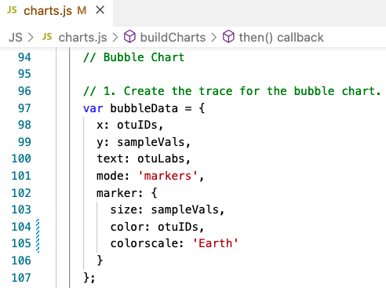

# plotly_deployment, Module 12 Challenge

Produces a mobile-responsive dashboard (Bars, Bubble and Gauge charts) to visualize data using JavaScript, Plotly, and D3.js. 

## Deliverable 1

Code to create the arrays when a sample is selected from the dropdown menu:

Code to create the trace object in the "buildCharts()" function, containing the following:

* "y" values are the otu_ids, in descending order
* "x" values are the sample_values, in descending order
* When "hovered over", the text is the otu_labels, in descending order

Code to create the layout array in the "buildCharts()" function that creates a title for the chart.

When the dashboard is first opened in a browser, ID 940’s data is displayed, and the bar chart shows the following:

* The top 10 sample_values are sorted in descending order
* The top 10 sample_values as values
* The otu_ids as the labels

## Deliverable 2

Code for the trace object in the "buildCharts()"; the function does the following:

* Sets the otu_ids as the x-axis values
* Sets the sample_values as the y-axis values
* Sets the otu_labels as the hover-text values
* Sets the sample_values as the marker size
* Sets the otu_ids as the marker colors

Code for the layout in the "buildCharts()"; the function does the following:

* Creates a title
* Creates a label for the x-axis
* The text for a bubble is shown when hovered over

When the dashboard is first opened in a browser, ID 940’s data should be displayed in the dashboard. All three charts should also be working according to their requirements when a sample is selected from the dropdown menu (10 pt)

## Deliverable 3

The code to build the gauge chart does the following:

* Creates a title for the chart
* Creates the ranges for the gauge in increments of two, with a different color for each increment
* Adds the washing frequency value on the gauge chart
* The indicator shows the level for the washing frequency on the gauge
* The gauge is added to the dashboard
* The gauge fits in the margin of the 
 element

When the webpage loads, the bar and bubble chart are working according to the requirements in Deliverable 1 and 2, respectively, and the gauge chart is working according to the requirements listed for this Deliverable (10 pt)

## Deliverable 4

You will earn a perfect score for Deliverable 4 by completing all requirements below:
The webpage has three customizations. (10 pt)

When the dashboard is first opened in a browser, ID 940’s data should be displayed in the dashboard, and all three charts should be working according to the requirements when a sample is selected from the dropdown menu (5 pt)

