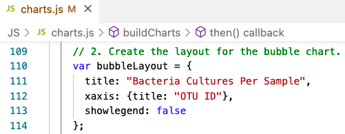
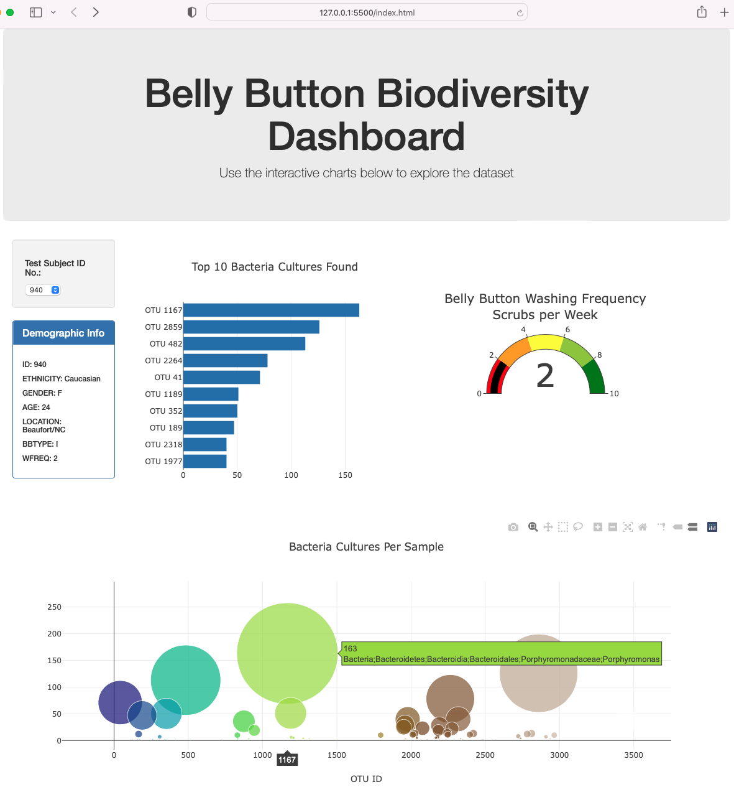

# plotly_deployment, Module 12 Challenge

This creates a mobile-responsive dashboard (Bars, Bubble and Gauge charts) to visualize 10 bacterial species from the volunteer's belly buttons using JavaScript, Plotly, and D3.js.

NOTE: the background photo is from "www.pixabay.com".

## Deliverable 1

Code to create the arrays when a sample is selected from the dropdown menu:

The code to create the trace object in the "buildCharts()" function contains the following:

* "y" values are the otu_ids, in descending order
* "x" values are the sample_values, in descending order
* When "hovered over", the text is the otu_labels, in descending order

The layout array code in the "buildCharts()" function creates a title for the chart.

When the dashboard is first opened in a browser, ID 940’s data is displayed, and the bar chart shows the following:

* The top 10 sample_values are sorted in descending order
* The top 10 sample_values as values
* The otu_ids as the labels

## Deliverable 2

The code for the trace object in the "buildCharts()" does the following:

* Sets the otu_ids as the x-axis values
* Sets the sample_values as the y-axis values
* Sets the otu_labels as the hover-text values
* Sets the sample_values as the marker size
* Sets the otu_ids as the marker colors

The layout code in the "buildCharts()" does the following:

* Creates a title
* Creates a label for the x-axis
* The text for a bubble is shown when hovered over

When the dashboard is first opened in a browser, ID 940’s data is displayed. All three charts work according to their requirements when a sample is selected from the dropdown menu.

All three charts work according to their requirements when a sample is selected from the dropdown menu. Sample 1242's data is shown hereafter.

## Deliverable 3

The code to build the gauge chart does the following:

* Creates a title for the chart
* Creates the ranges for the gauge in increments of two, with a different color for each increment
* Adds the washing frequency value on the gauge chart
* The indicator shows the level for the washing frequency on the gauge
* The gauge is added to the dashboard
* The gauge fits in the margin of the "div" element

When the webpage loads, the bar and bubble chart are working according to the requirements in Deliverable 1 and 2, respectively, and the gauge chart is working according to the requirements listed for this Deliverable.

## Deliverable 4

* Customization 1: increased the bar chart's width (from 5 to 6), and reduce the gauge chart (from 5 to 4) to improve the overal presentation

* Customization 2: enclosed all the charts in a box, used a new class called "boxed"

* Customization 3: added a background photo to "jumbotron"; changed the font color to white for better contrast and increased the size of the second sentence inside the paragraph "p"

When the dashboard is first opened in a browser, ID 940’s data is displayed.

All three charts are working according to the requirements when a sample is selected from the dropdown menu. Sample 1601's data is shown hereafter.

